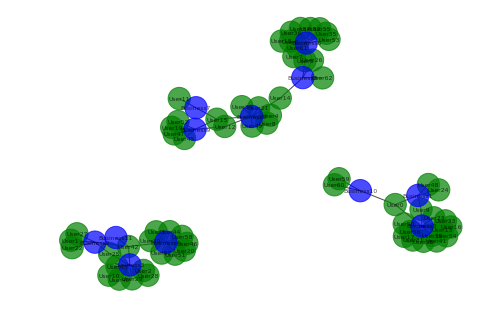

# NetworkX Introduction - Lab

## Introduction

In this lab, you'll practice some of the introductory skills for creating graphs using the NetworkX library introduced in the previous lesson. To do this, you'll create a graph to visualize users and businesses from yelp reviews. 

## Objectives

In this lab you will: 

- Create basic network graphs with networkx 
- Add nodes and edges to networkx graphs 
- Visualize network graphs with networkx 

## Import the Data

To start, import the data stored in the file `'Yelp_reviews.csv'`. 


```python
# Your code here
```


```python
# __SOLUTION__ 
import pandas as pd
df = pd.read_csv('Yelp_reviews.csv')
df.head()
```


<div>
<style scoped>
    .dataframe tbody tr th:only-of-type {
        vertical-align: middle;
    }

    .dataframe tbody tr th {
        vertical-align: top;
    }

    .dataframe thead th {
        text-align: right;
    }
</style>
<table border="1" class="dataframe">
  <thead>
    <tr style="text-align: right;">
      <th></th>
      <th>business_id</th>
      <th>date</th>
      <th>review_id</th>
      <th>stars</th>
      <th>text</th>
      <th>type</th>
      <th>user_id</th>
      <th>cool</th>
      <th>useful</th>
      <th>funny</th>
    </tr>
  </thead>
  <tbody>
    <tr>
      <th>0</th>
      <td>7SO_rX1F6rQEl-5s3wZxgQ</td>
      <td>2011-10-03</td>
      <td>GxaYFCprt-wyqO--vB4PHQ</td>
      <td>4</td>
      <td>After my last review, somewhat scathing regard...</td>
      <td>review</td>
      <td>J3I2NClEbD1Xr8lOdjxlqQ</td>
      <td>1</td>
      <td>2</td>
      <td>1</td>
    </tr>
    <tr>
      <th>1</th>
      <td>K2_Hmmo5crTYWiT_1sWnfQ</td>
      <td>2011-12-22</td>
      <td>FSrIgThMfFIh__TubVQkxw</td>
      <td>3</td>
      <td>Ok, so I'm catching up on past-due reviews.  F...</td>
      <td>review</td>
      <td>J3I2NClEbD1Xr8lOdjxlqQ</td>
      <td>0</td>
      <td>0</td>
      <td>0</td>
    </tr>
    <tr>
      <th>2</th>
      <td>FeI75xIG8PF_XZ6P80gLBQ</td>
      <td>2012-06-04</td>
      <td>eeJ10gamdNebtq028i0BvA</td>
      <td>3</td>
      <td>I want to like Turf, but the food is just okay...</td>
      <td>review</td>
      <td>64YY0h0ZAR2nbzxbx0IwJg</td>
      <td>2</td>
      <td>1</td>
      <td>0</td>
    </tr>
    <tr>
      <th>3</th>
      <td>6imLt53br7SJ3av07jjH7w</td>
      <td>2012-11-06</td>
      <td>SPDbkT9WXghJedf1xxYnOg</td>
      <td>5</td>
      <td>It's the place to be. \n\nI went before headin...</td>
      <td>review</td>
      <td>Ypz7hxOCnrg8Y8vxHJU-sQ</td>
      <td>0</td>
      <td>0</td>
      <td>0</td>
    </tr>
    <tr>
      <th>4</th>
      <td>zmFc8M-hS4uuyY0hklIpoQ</td>
      <td>2011-01-17</td>
      <td>A2lCUSvDJfIa5kwUoFFk8A</td>
      <td>4</td>
      <td>A definite favorite in the neighborhood.\n\nTh...</td>
      <td>review</td>
      <td>nDBly08j5URmrHQ2JCbyiw</td>
      <td>2</td>
      <td>3</td>
      <td>2</td>
    </tr>
  </tbody>
</table>
</div>


## Creating a Graph

Now, create an initial graph!


```python
# Your code here
```


```python
# __SOLUTION__ 
import networkx as nx
G = nx.Graph()
```

## Adding Nodes 

Create a node for each user and each business in the dataset. Networks with multiple node types like this are called **bimodal networks**.

Optionally, go further by creating a list of colors for when you visualize the graph. If you do this, append the color "green" to your color list every time you add a user node and append the color "blue" to your color list every time you add a business node.


```python
# Your code here
```


```python
# __SOLUTION__ 
names = {}
node_color = []
for n, person in enumerate(df.user_id.unique()):
    name = 'User{}'.format(n)
    names[person] = name
    G.add_node(name)
    node_color.append('green')
for n, biz in enumerate(df.business_id.unique()):
    name = 'Business{}'.format(n)
    names[biz] = name
    G.add_node(name)
    node_color.append('blue')  
```

## Adding Edges

Next, iterate through the dataset and create an edge between users and the businesses they have reviewed.


```python
# Your code here
```


```python
# __SOLUTION__ 
for row in df.index:
    user = df['user_id'][row]
    u_name = names[user]
    biz = df['business_id'][row]
    b_name = names[biz]
    G.add_edge(u_name, b_name)
```

## Visualizing the Graph

Finally, create a visualization of your network. If you chose to color your nodes, pass the list of colors through the optional `node_color` parameter.


```python
# Your code here
```


```python
# __SOLUTION__ 
%matplotlib inline
nx.draw(G, with_labels=True, alpha=0.7, font_size=6, node_size=500, node_color=node_color)
```





## Summary

Nice work! In this lab you created an initial network to visualize a bimodal network of businesses and yelp reviewers!
